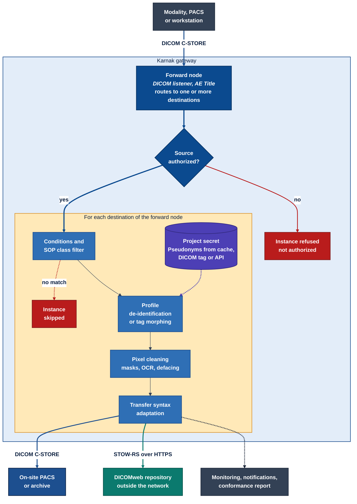

Karnak is a DICOM gateway: it receives studies through a DICOM listener, transforms them
according to the profiles configured on each destination, and forwards the result over
DICOM (C-STORE) or DICOMweb (STOW-RS). This page gives the big picture; the
[Installation](../installation), [Profiles](../profiles) and [User guide](../userguide)
sections cover each part in detail.

## Deployment workflow

A typical deployment feeds a research repository that lives **outside** the hospital or
imaging center: another institution, a research network or the cloud.



<a href="/images/karnak-workflow.svg" target="_blank">Open the diagram at full size</a>

**Inside the network**, the DICOM protocol is used as usual. Modalities, the PACS or a
workstation send studies to a Karnak [forward node](../userguide/gateway) with C-STORE: a
forward node is an AE Title served by the Karnak [DICOM listener](../installation/#dicom-listener),
and it can restrict the callers to a list of [sources](../userguide/gateway/sources)
identified by AE Title and hostname.

**Across the network boundary**, Karnak sends the de-identified studies to the repository
with a [STOW destination](../userguide/gateway/destinations/#stow-destination), that is
DICOMweb STOW-RS over HTTPS. This is the recommended protocol for any destination outside
the trusted network:

- **DICOM C-STORE is made for trusted networks.** It has no authentication or encryption
  by default, so a DICOM port must never be exposed on the Internet.
- **STOW-RS rides on HTTPS.** The transfer is encrypted with TLS and authenticated with an
  [OAuth 2 bearer token or Basic auth](../userguide/gateway/destinations/#generate-authorization-header);
  reverse proxies and firewalls apply as usual.
- **Outbound only.** Karnak opens a single outbound HTTPS connection to the repository; no
  inbound port is required on the hospital side.

An on-site archive, such as a research PACS in the same network, can still be reached with a
plain [DICOM destination](../userguide/gateway/destinations/#dicom-destination), and both
kinds of destinations can be combined on the same forward node. Only what the destination's
profile lets through leaves the network: pseudonyms instead of identities, shifted dates,
re-mapped UIDs and cleaned pixels. [Kheops](../userguide/kheops) is an example of a
DICOMweb repository that receives shared albums this way.

## Processing pipeline

The [forward node](../userguide/gateway) addressed by the called AE Title checks the
calling source, then routes each accepted instance to one or more destinations, where it
goes through the pipeline below once per destination. Every step is configured on the
[destination](../userguide/gateway/destinations).

1. **Source check.** If the forward node declares [sources](../userguide/gateway/sources),
   only those AE Titles (and optionally hostnames) are accepted; any other caller gets the
   DICOM status *Not authorized* and nothing is forwarded.
2. **Filtering.** A destination can restrict the forwarded
   [SOP Classes](../userguide/gateway/destinations/#9-authorized-sops) and evaluate a
   [condition](../profiles/conditions) on the DICOM attributes. Instances that do not
   match are skipped for that destination only; the other destinations of the forward
   node still receive them.
3. **Profile.** The destination applies either a
   [de-identification profile](../userguide/gateway/destinations/#8-de-identification)
   or a [tag-morphing profile](../userguide/gateway/destinations/#7-tag-morphing), never
   both. A de-identification profile chains
   [profile elements](../profiles/profilestructure): the DICOM basic confidentiality
   profile, tag actions, [date shifting](../profiles/dates), UID re-mapping and the
   pseudonymization keyed by the [project secret](../userguide/projects/#5-project-secret).
   The pseudonym itself comes from the Karnak cache (entered in the portal or
   [imported from CSV](../userguide/extpseudo)), from a DICOM tag, or from an
   [external API](../userguide/gateway/destinations/#pseudonym-type).
4. **Pixel cleaning.** Burned-in annotations are removed with hand-defined
   [masks](../profiles/masks) or automatically through the OCR service, and head CT studies
   can be [defaced](../profiles/masks/#defacing). If masking fails, nothing is sent.
5. **Transfer syntax.** The image is [transcoded](../userguide/gateway/destinations/#2-transfer-syntax)
   when the destination requires another transfer syntax.
6. **Send and report.** The instance is sent with C-STORE or STOW-RS. The transfer is
   tracked in [Monitoring](../userguide/monitoring), summarized in
   [email notifications](../userguide/gateway/destinations/#4-notifications), and optionally
   validated in a [DICOM conformance report](../userguide/conformancereport). A
   [virtual destination](../userguide/gateway/destinations/#5-virtual-destination) runs
   the whole pipeline and produces the report without sending anything.
