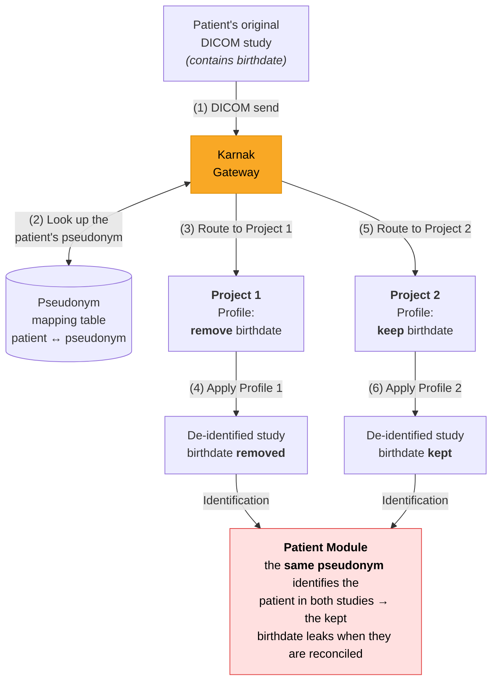
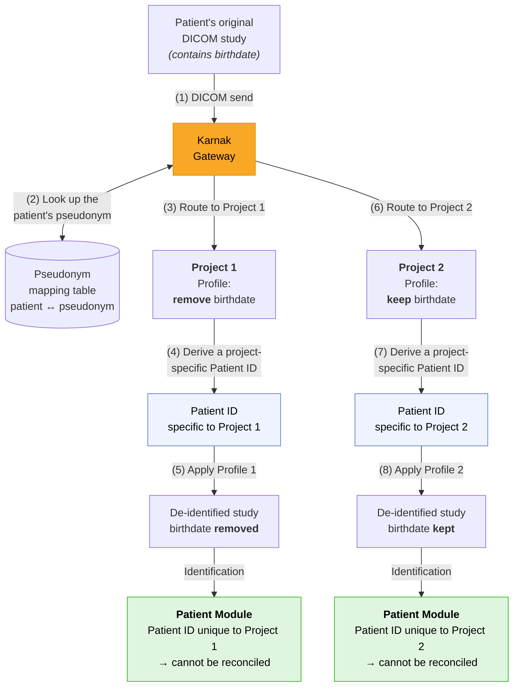

This page provides technical details about how Karnak performs DICOM de-identification, including the algorithms used for UID generation, date shifting, and pseudonymization.

## Overview

Karnak is a gateway that receives DICOM files and forwards them to one or multiple destinations using DICOM or DICOMWeb protocols. Each destination can be linked to a project that defines the de-identification method and a secret used to generate deterministic values.

## Basic Profile

The [Basic Profile](../profilestructure/#basic-dicom-profile) for de-identifying DICOM objects is provided by the [DICOM standard](http://dicom.nema.org/medical/dicom/current/output/chtml/part15/chapter_E.html). This profile defines an exhaustive list of DICOM tags and their related actions for proper de-identification.

### De-identification Actions

Five different actions are defined in the DICOM standard:

| Action | Description |
|--------|-------------|
| **D** | Replace with a dummy value |
| **Z** | Set to null |
| **X** | Remove |
| **K** | Keep |
| **U** | Replace with a new UID |

### Multiple Actions for IOD Conformance

The [DICOM type](http://dicom.nema.org/dicom/2013/output/chtml/part05/sect_7.4.html) is often dependent on the [Information Object Definition (IOD)](http://dicom.nema.org/medical/dicom/current/output/chtml/part04/chapter_6.html) of the instance. To avoid DICOM corruption, multiple actions can be defined for a tag, ensuring that destructive actions like REMOVE won't be applied on Type 1 or Type 2 attributes.

**Combined actions:**

| Action | Behavior                                                                                           |
|--------|----------------------------------------------------------------------------------------------------|
| **Z/D** | Z unless D is required to maintain IOD conformance (Type 2 versus Type 1)                          |
| **X/Z** | X unless Z is required to maintain IOD conformance (Type 3 versus Type 2)                          |
| **X/D** | X unless D is required to maintain IOD conformance (Type 3 versus Type 1)                          |
| **X/Z/D** | X unless Z or D is required to maintain IOD conformance (Type 3 versus Type 2 versus Type 1)       |
| **X/Z/U*** | X unless Z or replacement of contained instance UIDs (U) is required to maintain IOD conformance. (Type 3 versus Type 2 versus Type 1 sequences containing UID references) |

**Action Selection:**

Karnak loads the SOPs and attributes as specified in the DICOM Standard. Based on the tag's type in the current instance, the proper action is set and applied. 

> [!INFO]
> If the tag cannot be identified in the SOP or its type cannot be inferred, the strictest action will be applied (U/D > Z > X).

**Examples of action resolution:**

- **Z/D, X/D, X/Z/D** → apply action **D**
- **X/Z** → apply action **Z**
- **X/Z/U, X/Z/U*** → apply action **U**

---

## Action D: Replace with Dummy Value

The action D replaces the tag value with a dummy one that is consistent with the [Value Representation](http://dicom.nema.org/medical/dicom/current/output/chtml/part05/sect_6.2.html) (VR) of the tag.

### Default Values by VR

Karnak uses these default values based on the VR when no specific dummy value is defined:

| Value Representation | Default Value | Notes |
|----------------------|---------------|-------|
| AE, CS, LO, LT, PN, SH, ST, UN, UT, UC, UR | `"UNKNOWN"` | Text-based values |
| DS, IS | `"0"` | Numeric strings |
| AS, DA, DT, TM | Generated date/time | Uses [Shift Date](#shift-date-generate-a-random-date) |
| UI | Generated UID | Uses [Action U](#action-u-generate-a-new-uid) |
| FL, FD, SL, SS, UL, US | Null | Binary values set to null |

### Date Generation

For date and time VRs (AS, DA, DT, TM), the **shiftRange()** function generates a random value within configurable limits:

- **Default maximum days:** 365
- **Default maximum seconds:** 86400

---

## Action U: Generate a New UID

For each U action, Karnak hashes the input value using a one-way function to ensure it's not possible to revert to the original UID. The function hashes the input UID and generates a new deterministic UID from the result.

### Context and Project Secrets

A DICOM study may be de-identified multiple times using different methods. Karnak ensures deterministic UID generation to maintain data quality and usability.

**Requirements:**

1. A project must be created and associated with the destination
2. The project defines a de-identification method and a secret
3. The project's secret is used as the key for the HMAC algorithm

#### Project Secret Format

> [!INFO]
> The secret is 16 bytes long and randomly generated when the project is created.

Users can upload their own secret, but it must be exactly 16 bytes long in hexadecimal format.

### Hash Function

The algorithm used is "Message Authentication Code" (MAC). Karnak uses MAC as a one-way function rather than for message authentication.

According to the [Java Mac class documentation](https://docs.oracle.com/en/java/javase/25/docs/api/java.base/javax/crypto/Mac.html):

> *A MAC provides a way to check the integrity of information transmitted over or stored in an unreliable medium, based on a secret key. Typically, message authentication codes are used between two parties that share a secret key in order to validate information transmitted between these parties.*
>
> *A MAC mechanism that is based on cryptographic hash functions is referred to as HMAC. HMAC can be used with any cryptographic hash function, e.g., SHA256 or SHA384, in combination with a secret shared key. HMAC is specified in RFC 2104.*

**Karnak's HMAC Configuration:**

- **Hash function:** SHA256
- **Secret key:** Project's secret (16 bytes)

### UID Generation Process

Karnak generates a new [DICOM UID](https://dicom.nema.org/medical/dicom/current/output/chtml/part05/sect_B.2.html) that starts with the OID root `"2.25"` followed by a decimal representation of a UUID derived from the HMAC hash.

The value after "2.25." is the straight decimal encoding of the UUID as an integer. It must be a direct decimal encoding of the single integer, all 128 bits. See [How do you create an OID?](https://wiki.ihe.net/index.php/Creating_Unique_IDs_-_OID_and_UUID)


#### UUID Generation Algorithm

The generated UUID uses the first 16 bytes (128 bits) from the hash value as a UUID type 4 with variant 1.

**Pseudocode to ensure correct UUID type and variant:**

```
// Version
uuid[6] &= 0x0F
uuid[6] |= 0x40

// Variant
uuid[8] &= 0x3F
uuid[8] != 0x80
```

**Final UID format:**

```
uuid = “2.25.” + HashedValue[0:16].toPositiveDecimal()
```

## Shift Date: Generate a Random Date

Karnak implements randomized date shifting that is consistent per patient and project, ensuring data consistency across all instances for the same patient.

### Algorithm

The random shift uses the HMAC function (defined above) with a configurable range of days or seconds. 

**Default values:**
- Minimum: 0 (if not specified)
- Maximum: User-defined

**Process:**

1. The Patient ID is hashed using the project's secret
2. The hash is converted to a numeric value within the specified range
3. The same shift is applied to all date fields for that patient

**Pseudocode:**

```
scaleHash(PatientID, scaledMin, scaledMax):
    patientHashed = hmac.hash(PatientID)
    scale = scaledMax - scaledMin

    shift = (patientHashed[0:6].toPositiveDecimal() * scale) + scaledMin
```

> [!INFO]
> The Patient ID combined with the project's secret ensures that date shifts are deterministic per patient while remaining unpredictable across different patients.

## Pseudonymization

This section explains how Karnak handles Patient ID generation to prevent data leakage across different de-identification methods.

### The Problem

A patient participating in multiple research projects may encounter different de-identification methods. Most patient identifying information is contained in the [Patient Module](http://dicom.nema.org/medical/dicom/current/output/chtml/part03/sect_C.2.html).

**Risk scenario:**

If the same pseudonym is used across projects with different de-identification profiles, data can be leaked when studies are reconciled.

#### Example: Data Leakage Risk

In this example, a patient's study falls within the scope of two different projects:
- **Project 1**: Removes the patient birthdate
- **Project 2**: Keeps the patient birthdate

If the patient pseudonym is used as patient identification and the data is reconciled, the birthdate will be leaked.



Because both studies are identified by the **same pseudonym**, reconciling them re-associates the kept birthdate (Project 2) with the patient whose birthdate Project 1 removed.

### The Solution: Project-Specific Patient IDs

Karnak generates a unique Patient ID based on the pseudonym and project-specific characteristics. This prevents reconciliation across projects and eliminates data leakage.



Each project derives its **own Patient ID** from the pseudonym and the project's secret, so the two studies can no longer be reconciled — the kept birthdate stays isolated to Project 2.

### PatientID Generation

The de-identified Patient ID is generated as follows:

1. The patient's pseudonym is retrieved from an external service or mapping table
2. The pseudonym is hashed using the HMAC function and the project's secret
3. The Patient ID is set to the first 16 bytes of the hashed pseudonym (in hexadecimal format)

> [!INFO]
> This makes the Patient ID unique and deterministic within the context of the project, preventing cross-project reconciliation.

**Patient Name:**

The pseudonym is used as the Patient's Name if no other action has been defined during de-identification.


## Attributes Added by Karnak

Karnak automatically sets certain attributes during de-identification to maintain compliance and traceability.

### SOP Common Module

The following attributes are set in the [SOP Common Module](http://dicom.nema.org/medical/dicom/current/output/chtml/part03/sect_C.12.html#sect_C.12.1):

| Tag | Attribute Name | Value | Format |
|-----|----------------|-------|--------|
| **(0008,0013)** | Instance Creation Time | Time the SOP instance was created | TM (HHMMSS.FFFFFF) |
| **(0008,0012)** | Instance Creation Date | Date the SOP instance was created | DA (YYYYMMDD) |

### Patient Module

The following attributes are set in the [Patient Module](http://dicom.nema.org/medical/dicom/current/output/chtml/part03/sect_C.7.html#sect_C.7.1.1):

| Tag | Attribute Name | Value | Notes |
|-----|----------------|-------|-------|
| **(0010,0020)** | Patient ID | Hashed pseudonym | See [PatientID Generation](#patientid-generation) |
| **(0010,0010)** | Patient Name | Pseudonym | If no other action is applied |
| **(0012,0062)** | Patient Identity Removed | `YES` | Indicates de-identification |
| **(0012,0063)** | De-identification Method | Concatenated profile codenames | See format below |

#### De-identification Method Format

Profile element codenames are concatenated and separated by `-`.

**Example:**

A profile composed of:
- `action.on.specific.tags`
- `basic.dicom.profile`

Will appear as: `action.on.specific.tags-basic.dicom.profile`

### Clinical Trial Subject Module

The following attributes are set in the [Clinical Trial Subject Module](http://dicom.nema.org/medical/dicom/current/output/chtml/part03/sect_C.7.html#sect_C.7.1.3):

| Tag | Attribute Name | Value |
|-----|----------------|-------|
| **(0012,0010)** | Clinical Trial Sponsor Name | Project name |
| **(0012,0020)** | Clinical Trial Protocol ID | Profile codename (concatenated) |
| **(0012,0021)** | Clinical Trial Protocol Name | Null |
| **(0012,0030)** | Clinical Trial Site ID | Null |
| **(0012,0031)** | Clinical Trial Site Name | Null |
| **(0012,0040)** | Clinical Trial Subject ID | Pseudonym |
